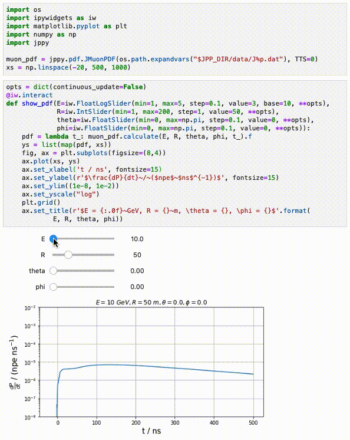

The jppy Python package
=======================

.. image:: https://git.km3net.de/km3py/jppy/badges/master/pipeline.svg
    :target: https://git.km3net.de/km3py/jppy/pipelines

.. image:: https://git.km3net.de/examples/km3badges/-/raw/master/docs-latest-brightgreen.svg
    :target: https://km3py.pages.km3net.de/jppy

This software provides Python access to functionalities in Jpp, like accessing
PDF and NPE functions.

It currently depends on a few Jpp headers (no Jpp compilation needed), which are
bundled with the package. However, if you want to use another (newer) Jpp version,
make sure the ``$JPP_DIR`` is pointing to the Jpp directory.

Installation
============

If you work on the Lyon CC, you can load the ``jpp/master`` module which
contains the latest release of ``jppy``::

    module load jpp/master

Before installing manually, make sure the ``$JPP_DIR`` environment variable
is pointing to the Jpp directory otherwise it will use some older Jpp headers
for compilation. Please note that only the headers of Jpp are needed,
it is not necessary to compile the whole Jpp framework!
For the sake of completeness, here is how to do it::

    git clone --recursive git@git.km3net.de:common/jpp.git
    export JPP_DIR=$(pwd)/jpp
    
You also need the ``pybind11`` headers and on some Linux also the
``python-dev`` package::

    brew install pybind11                      # macOS
    sudo pacman -S pybind11                    # Arch based Linux
    sudo apt-get install pybind11 python3-dev  # Debian based Linux (e.g. Ubuntu)

The package can then be installed via ``pip``::

    pip install jppy

or directly from the Git repository to get the latest stable from the
``master`` branch::

    pip install git+https://git.km3net.de/km3py/jppy

or from a local clone::

    git clone https://git.km3net.de/km3py/jppy
    pip install jppy/

Example - Using PDFs
====================

The latest PDF data files can be downloaded from `the KM3NeT SFTP Server <http://sftp.km3net.de/data/latest/>`_.
In CC Lyon, these files are stored in ``$JPP_DIR/data``.

Here is an example how to play around with muon PDFs using the ``jppy`` module
in Lyon. Notice that ``jppy`` is already installed in the ``jpp/master``
module::

    ░ tgal@cca010:~
    ░ 13:22:51 > module load jpp/master
    ░ tgal@cca010:~
    ░ 13:22:54 > module list
    Currently Loaded Modulefiles:
      1) xrootd/4.8.1                      5) tools/tig/2.4.1
      2) km3net_env/1.1                    6) tools/the_silver_searcher/2.2.0
      3) python/3.7.5                      7) root/6.18.04
      4) tools/neovim/0.5.0                8) jpp/master
    ░ tgal@cca010:~
    ░ 13:22:56 > ipython
    Python 3.7.5 (default, Nov  1 2019, 21:18:20)
    Type 'copyright', 'credits' or 'license' for more information
    IPython 7.9.0 -- An enhanced Interactive Python. Type '?' for help.

    In [1]: import jppy

    In [2]: jppy.version
    Out[2]: '3.0.0a6'

    In [3]: jppy.pdf.JMuonPDF?
    Docstring:      <no docstring>
    Init docstring: __init__(self: jppy.pdf.JMuonPDF, file_descriptor: str, TTS: float, number_of_points: int = 25, epsilon: float = 1e-10) -> None
    File:           /pbs/throng/km3net/software/python/3.7.5/lib/python3.7/site-packages/jppy/pdf.cpython-37m-x86_64-linux-gnu.so
    Type:           pybind11_type
    Subclasses:

    In [4]: muon_pdf = jppy.pdf.JMuonPDF("/pbs/throng/km3net/src/Jpp/master/data/J%p
       ...: .dat", 0)
    loading input from file /pbs/throng/km3net/src/Jpp/master/data/J1p.dat... OK
    loading input from file /pbs/throng/km3net/src/Jpp/master/data/J2p.dat... OK
    loading input from file /pbs/throng/km3net/src/Jpp/master/data/J3p.dat... OK
    loading input from file /pbs/throng/km3net/src/Jpp/master/data/J4p.dat... OK
    loading input from file /pbs/throng/km3net/src/Jpp/master/data/J5p.dat... OK
    loading input from file /pbs/throng/km3net/src/Jpp/master/data/J6p.dat... OK
    adding PDFs... OK

    In [5]: muon_pdf.calculate?
    Docstring: calculate(self: jppy.pdf.JMuonPDF, E: float, R: float, theta: float, phi: float, t1: float) -> JTOOLS::JResultPDF<double>
    Type:      method

    In [6]: result = muon_pdf.calculate(10, 5, 0, 0, 23)

    In [7]: result?
    Type:           JResultPDF
    String form:    <jppy.pdf.JResultPDF object at 0x7f735b5ca770>
    File:           /pbs/throng/km3net/software/python/3.7.5/lib/python3.7/site-packages/jppy/pdf.cpython-37m-x86_64-linux-gnu.so
    Docstring:      <no docstring>
    Init docstring: __init__(self: jppy.pdf.JResultPDF, f: float, fp: float, v: float, V: float) -> None

    In [8]: result.f
    Out[8]: 0.0015357848280127355

    In [9]: result.fp
    Out[9]: -2.228096911939611e-05

    In [10]: result.v
    Out[10]: 0.02490276362751662

    In [11]: result.V
    Out[11]: 0.1164929687159807

    In [12]: %timeit muon_pdf.calculate(10, 5, 0, 0, 23)
    2.47 µs ± 293 ns per loop (mean ± std. dev. of 7 runs, 100000 loops each)
